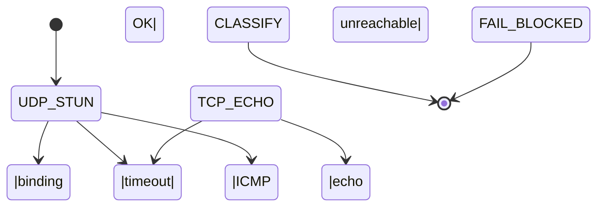

# Design overview

This document explains **how the NAT‑Detection toolset works under the hood** so that contributors can comfortably extend or refactor the code‑base.

---

## 1 · Components

| Binary      | Location            | Role | Default listen / dial |
|-------------|---------------------|------|-----------------------|
| `natcheck`  | `client/`           | CLI run on the user’s host; enumerates interfaces, launches probes, prints verdicts | — |
| `stun`      | `server/stun/`      | Minimal STUN Binding responder | `UDP 3478` |
| `whoami`    | `server/whoami/`    | One‑line TCP echo service used when UDP is blocked | `TCP 8080` |
| `asnlookup` | `tools/asnlookup/`  | Lookup helper used in tests / debug | — |
| `stun` lib  | `internal/stun/`    | Pure‑Go encoder / decoder for the few STUN attributes we need | n/a |

---

## 2 · Probe state machine (per interface & family)



* **UDP_STUN** – sends a Binding Request (RFC 5389) with random TxID.
* **TCP_ECHO** – connects to the same host on 8080/tcp, reads first line.
* **CLASSIFY** – runs the rules table (§4) to decide *None / CPE NAT / CG‑NAT / NAT66 / Symmetric / UDP‑blocked*.

---

## 3 · Packet formats we parse / emit

### 3.1 STUN Binding Request (client → server)

```
0               1               2               3
0 1 2 3 4 5 6 7 8 9 A B C D E F 0 1 2 3 4 5 6 7 8 9 A B C D E F  (octets)
+--+--+--+--+--+--+--+--+--+--+--+--+--+--+--+--+--+--+--+--+--+--+--+--+
|     0x0001    |      0x0000     |        0x2112A442              |
+---------------+-----------------+--------------------------------+
|                         Transaction‑ID (96 bits)                 |
+------------------------------------------------------------------+
```

### 3.2 Binding Success (server → client)

Same header but Type =`0x0101` and Length =`8` (IPv4) or `20` (IPv6), followed by **XOR‑MAPPED‑ADDRESS** attr:

```
0x0020 | len | 0 | fam | X‑Port | X‑IP …
```

Our hand‑rolled parser lives in `internal/stun/message.go`.

---

## 4 · Classification rules

> **Notation** – Inside = local socket IP, Outside = value returned by server

| inside fam | outside present? | inside scope | outside scope | ASN check | Verdict |
|------------|-----------------|--------------|---------------|-----------|---------|
| v4 global  | yes | global | global same | n/a | **No NAT** |
| v4 private 10/8 | yes | private | global | outside ASN ≠ allow‑list | **CG‑NAT** |
| v4 private (any) | yes | private | global | outside ASN matches | **CPE NAT** |
| v6 ULA | yes | ULA | global | n/a | **NAT66 / NPTv6** |
| any | no | – | – | – | **UDP blocked** (fall back to TCP) |

*Symmetric vs full‑cone* discrimination is done by sending a second
Binding Request **to a different destination port** and comparing the
mapped endpoints.

---

## 5 · Security considerations

* **No reflection / amplification** – STUN server replies only to requests and never larger than incoming payload.
* **DynamicUser** via systemd or `CAP_NET_BIND_SERVICE` keeps the daemons unprivileged.
* The TCP echo outputs exactly one line (max 64 bytes) → cannot be abused for arbitrary data exfil.

---

## 6 · Extending the code‑base

| Task | Where to touch |
|------|----------------|
| Implement another ASN provider | `client/asn.go` – satisfy `ASNProvider` interface |
| Deeper NAT fingerprinting (RFC 5780) | `client/probe.go` – send additional STUN to alternate IP/port |
| Support JSON output | `client/format.go` – add `--output json` flag |

---

## 7 · Roadmap ideas

* **Web UI** that wraps `natcheck` via WASM for non‑technical users.
* **Prometheus exporter** for fleet monitoring of CG‑NAT incidence.
* **eBPF** interface pinning on Linux instead of best‑effort `Dialer.LocalAddr`.

---

_Last updated: 2025‑04‑20_
